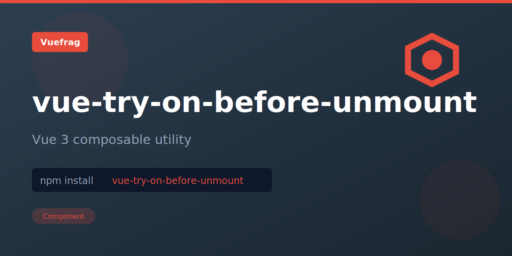

<p align="center">
  
</p>

<h1 align="center">vue-try-on-before-unmount</h1>

<p align="center">A Vue 3 composition API utility that safely calls onBeforeUnmount when inside component setup context, and gracefully handles calls outside setup without errors.</p>

<p align="center">
  <a href="https://www.npmjs.com/package/vue-try-on-before-unmount"></a>
  <a href="https://www.npmjs.com/package/vue-try-on-before-unmount"></a>
</p>

## Installation

```bash
npm install vue-try-on-before-unmount
```

## Usage

```ts
import { tryOnBeforeUnmount } from 'vue-try-on-before-unmount'

tryOnBeforeUnmount(() => {
  console.log('Component is about to unmount')
})

console.log('Cleanup registered')
```

## License

MIT

Extracted from [VueUse](https://vueuse.org/) for standalone use.
